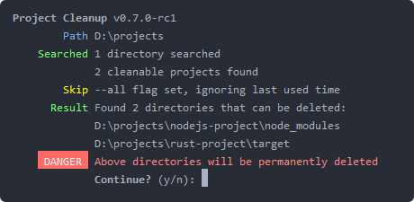

[](https://woubuc.github.io/project-cleanup/)

[](https://www.npmjs.com/package/project-cleanup)
[](https://crates.io/crates/project-cleanup)
[](https://github.com/woubuc/project-cleanup/releases/latest)
[](https://github.com/woubuc/project-cleanup/blob/master/LICENSE)
[](https://github.com/woubuc/project-cleanup/blob/master/.github/workflows/tests.yml)

This little tool will recursively browse a directory to find code
projects in several languages. If the project hasn't been touched for
more than a month, it will remove directories containing libraries,
dependencies, builds, etc.

The reasoning behind this is that these files can be retrieved or
re-generated at any time, but if you haven't worked on the project for
a month chances are you don't need them taking up space on your hard
drive right now.



## Install
There are several ways to install project cleanup

#### Install via npm
Useful if you want to install this along with your Node project's dev-dependencies and invoke it from a script.

```
npm install --global project-cleanup
```

The npm package will automatically download the relevant binary from Github.

#### Manual download
Download the binary for your platform from the
[releases page](https://github.com/woubuc/project-cleanup/releases)

#### Build with Cargo
The Rust way. This compiles the application from the sources published to crates.io.

```
cargo install project-cleanup
```

#### Other
If you have a favourite package manager, feel free to [create an issue](https://github.com/woubuc/project-cleanup/issues) to discuss how we can publish project cleanup to your package manager.

## How it works
Run the application with `project-cleanup --help` to see the options.

## Supported languages
- Node.js (will remove the `node_modules` and `.cache` directories)
- Rust (will remove the `target` directory)
- Java (will remove the `.gradle` and `build` directories)

These languages are based on my own experience and use patterns.

### Custom rules
Create a file named `.cleanuprc` in the root directory of a project,
and list all paths that should be deleted when running project cleanup.

See the [.cleanuprc](./.cleanuprc) file in this repository for an example.

**Note**: If a `.cleanuprc` file is found, the default directories will be
skipped entirely, so you will need to add them to your `.cleanuprc` if you
still want to clean them.

### Adding more defaults
Contributions are welcome! Add the necessary checks in
[src/discover_projects/detect_cleanable_project.rs](https://github.com/woubuc/project-cleanup/blob/master/src/discover_projects/detect_cleanable_project.rs)
and submit a pull request to add more built-in languages, or to add
more unnecessary directories to existing languages.

## License
Everything in this repository is published under the MIT license. See
the LICENSE file for more information.
